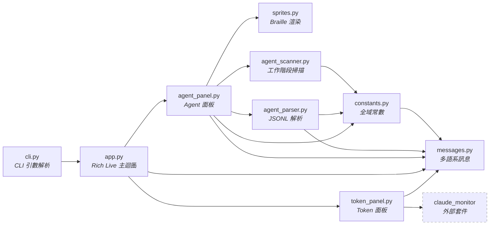
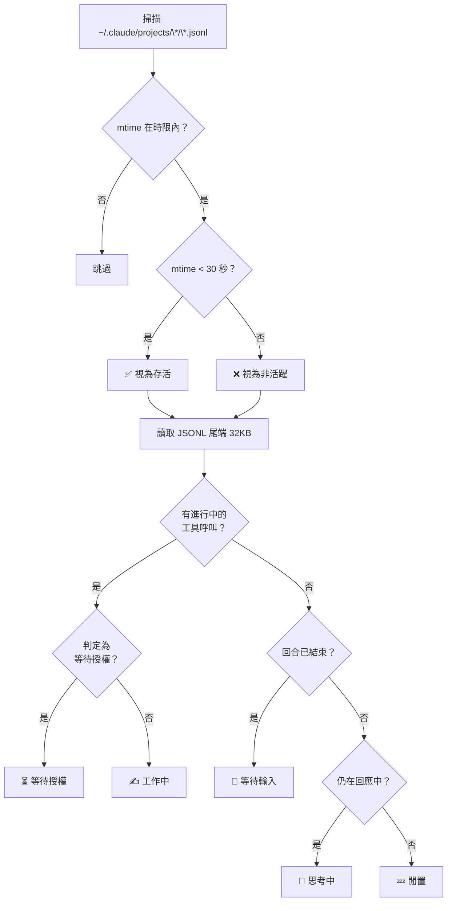

# Claude Code Dashboard

[](https://www.python.org/)
[](https://pypi.org/project/claude-code-dashboard/)
[](LICENSE)

Claude Code Dashboard 是一個終端介面（TUI）工具，整合兩大功能於同一畫面：

1. **Token 用量面板** — 直接延用 [claude-monitor (ccm)](https://github.com/Maciek-roboblog/Claude-Code-Usage-Monitor) 的即時用量介面，顯示費用、Token 消耗量、燃燒率、預測等
2. **Agent 狀態面板** — 受 [Pixel Agents](https://github.com/pablodelucca/pixel-agents) 啟發，以像素精靈動畫顯示每個 Claude Code 工作階段的即時狀態


<br>

## 功能特色

- **即時刷新** — 畫面以 2 Hz 更新，資料依指定間隔掃描
- **像素精靈動畫** — 5 種狀態各有兩幀動畫，使用 Unicode Braille 字元渲染（無需圖片協議支援）
- **多工作階段偵測** — 同一專案可同時顯示多個 Agent（自動編號 #1, #2, ...）
- **檔案式偵測** — 以 JSONL mtime 判斷工作階段存活，支援 macOS / Linux / Windows
- **雙主題切換** — Token 面板支援預設佈局與 ccm 原版介面兩種主題
- **12 / 24 小時制** — 時間顯示格式可透過 `--time-format` 切換
- **多語系支援** — 自動偵測系統語系，支援英文、繁體中文、簡體中文、日文、韓文，可透過 `--lang` 切換
- **跨終端相容** — 純 Unicode 文字輸出，VS Code 終端、iTerm2、Terminal.app 皆可使用

<br>

## 專案架構

```
claude-code-dashboard/
├── pyproject.toml
├── README.md
├── LICENSE
├── .gitignore
└── src/
    └── claude_code_dashboard/
        ├── __init__.py
        ├── __main__.py
        ├── cli.py                    # CLI 引數解析（argparse）
        ├── constants.py              # 全域常數（門檻值、預設值、顯示設定）
        ├── app.py                    # 主迴圈（Rich Live 即時刷新）
        ├── token_panel.py            # Token 面板（預設佈局 + ccm 原版主題）
        ├── agent_scanner.py          # 工作階段掃描（JSONL mtime 偵測）
        ├── agent_parser.py           # JSONL 解析（推斷 Agent 狀態）
        ├── agent_panel.py            # Agent 面板（精靈卡片渲染）
        ├── sprites.py                # 像素精靈定義與 Braille 渲染引擎
        └── messages.py               # 多語系訊息定義（EN / ZH_TW / ZH_CN / JA / KO）
```

### 模組依賴關係



### Agent 偵測流程



### 各模組職責

| 模組 | 職責 |
|------|------|
| `cli.py` | 定義 CLI 參數、進入點 |
| `app.py` | Rich Live 主迴圈，組合所有面板 |
| `token_panel.py` | Token 用量面板（預設主題：預設進度條 + 雙欄佈局；ccm 主題：原版介面） |
| `agent_scanner.py` | 掃描 `~/.claude/projects/` 的 JSONL 檔案，以 mtime 判斷存活 |
| `agent_parser.py` | 讀取 JSONL 尾端，結合系統事件與計時器推斷 Agent 狀態 |
| `agent_panel.py` | 將工作階段與狀態組合為 Rich Panel 卡片 |
| `sprites.py` | 定義 14×12 像素網格，轉換為 Unicode Braille 字元 |
| `constants.py` | 所有門檻值、計時器、顏色、預設值的集中管理 |
| `messages.py` | 多語系訊息定義（`Messages` dataclass + EN/ZH_TW/ZH_CN/JA/KO 實例 + 語系自動偵測） |

<br>

## 安裝方式

### 前置需求

- **macOS / Linux / Windows**（需先安裝 [Claude Code](https://code.claude.com/docs/en/setup)）
- **Python 3.9+**
- **[uv](https://docs.astral.sh/uv/)** — 新一代 Python 套件管理器（以 Rust 實作，速度極快）
- **[claude-monitor](https://github.com/Maciek-roboblog/Claude-Code-Usage-Monitor)** (ccm) — Token 用量追蹤（安裝時自動安裝）

> **什麼是 uv？**
>
> [uv](https://docs.astral.sh/uv/) 是 Astral 開發的 Python 套件管理器，用來取代 `pip`、`venv`、`pipx` 等工具。
> 它會自動管理虛擬環境與相依套件，安裝速度比 pip 快 10–100 倍。
>
> - `uv tool install <pkg>` — 將套件安裝為全域命令列工具（類似 `npm install -g`）
> - `uv run <cmd>` — 在專案的虛擬環境中執行命令（類似 `npx`）
> - `uv pip install <pkg>` — 傳統 pip 的加速替代方案
>
> 安裝 uv：`curl -LsSf https://astral.sh/uv/install.sh | sh`

### 方法一：uv tool install（推薦）

將 `claude-code-dashboard` 安裝為全域命令列工具，自動建立隔離的虛擬環境

從 PyPI 安裝（推薦）：

```bash
uv tool install claude-code-dashboard
```

或從本機原始碼安裝：

```bash
cd claude-code-dashboard
uv tool install .
```

安裝完成後，在任何目錄都可直接執行（全名或縮寫皆可）：

```bash
claude-dash --plan max5
# 或
ccd --plan max5
```

更新到最新版：

```bash
uv tool upgrade claude-code-dashboard
```

### 方法二：uv run（開發用途）

不安裝，直接在專案目錄中執行。uv 會自動建立 `.venv` 並安裝相依套件

```bash
cd claude-code-dashboard
uv run claude-dash --plan max5
# 或 uv run ccd --plan max5
```

### 方法三：pip install（傳統方式）

```bash
cd claude-code-dashboard
python -m venv .venv && source .venv/bin/activate
pip install .
claude-dash --plan max5
# 或 ccd --plan max5
```

<br>

## 使用方式

**名稱對照**：本專案使用三個名稱，語境不同請對應使用。

| 語境 | 名稱 | 範例 |
|------|------|------|
| PyPI 套件 / 專案目錄 | **claude-code-dashboard** | `pip install claude-code-dashboard`、`cd claude-code-dashboard` |
| 指令（全名） | **claude-dash** | `claude-dash --plan max5` |
| 指令（縮寫） | **ccd** | `ccd --plan max5` |

### 基本使用

以下範例以 `claude-dash` 為例，亦可改用縮寫 `ccd`：

```bash
# 顯示所有面板（Token + Agent），使用 max5 方案
claude-dash --plan max5

# 僅顯示 Agent 面板
claude-dash --view agents

# 僅顯示 Token 面板
claude-dash --view tokens
```

### CLI 參數一覽

| 參數 | 預設值 | 說明 |
|------|--------|------|
| `--plan` | `max5` | Token 方案等級：`pro` / `max5` / `max20` / `custom` |
| `--timezone` | `Asia/Taipei` | IANA 時區名稱 |
| `--view` | `all` | 顯示面板：`all` / `tokens` / `agents` |
| `--refresh` | `10` | 資料刷新間隔（秒） |
| `--idle-timeout` | `10` | 隱藏閒置超過 N 分鐘的 Agent |
| `--max-agents` | `0` | 最多顯示的 Agent 卡片數量（0=不限） |
| `--show-all` | `false` | 顯示 30 分鐘內的所有工作階段 |
| `--no-sprites` | `false` | 停用像素精靈，改用純文字模式 |
| `--token-theme` | `default` | Token 面板主題：`default` / `ccm` |
| `--time-format` | `24h` | 時間格式：`24h` / `12h`（上午/下午） |
| `--lang` | `auto` | 介面語系：`auto` / `en` / `zh_TW` / `zh_CN` / `ja` / `ko` |
| `--version` | — | 顯示版本號 |

### 使用範例

```bash
# 快速刷新，顯示所有工作階段
claude-dash --plan max5 --refresh 5 --show-all

# 純文字模式（適合螢幕閱讀器或低解析度終端）
claude-dash --view agents --no-sprites

# 僅顯示最多 4 個 Agent
claude-dash --max-agents 4

# 使用不同時區
claude-dash --timezone America/New_York

# 切換為 ccm 原版 Token 面板主題
claude-dash --token-theme ccm

# 使用 12 小時制時間格式
claude-dash --time-format 12h

# 指定繁體中文介面
claude-dash --lang zh_TW

# 指定日文介面
claude-dash --lang ja
```

<br>

## 運作原理

### Token 面板

提供兩種主題（透過 `--token-theme` 切換）：

- **`default`**：預設的進度條 + 響應式雙欄佈局。上半部顯示 Cost / Tokens / Messages 三列全寬進度條；下半部為左右並排的 Models 堆疊色條 + Burn Rate 與 Reset In 倒數計時 + Predictions 時間預估。窄螢幕自動轉為單欄。
- **`ccm`**：直接匯入 ccm 的 `DisplayController.create_data_display()` 方法，顯示效果與 `ccm --view realtime` 完全相同。

### 像素精靈渲染

使用 **Unicode Braille 字元**（U+2800–U+28FF）實現終端機中的「像素級」繪圖：

- 每個 Braille 字元編碼 2×4 的點陣矩陣（8 個像素點）
- 比一般方塊字元精細 **8 倍**
- 14×12 像素的精靈網格渲染為 7 字元寬 × 3 行高
- 每個 2×4 區塊以「多數決」選出代表顏色
- 支援 7 種顏色（膚色、頭髮、上衣、褲子、強調色、家具、特效）
- 每種狀態有 2 幀動畫，以 0.5 秒間隔交替

> **為什麼不用 Sixel / Kitty 圖片協議？**
> 因為 VS Code 內建終端不支援任何圖片協議。Braille 字元是純 Unicode 文字，在所有終端都能正確顯示。

<br>

## 開發與發佈

詳見 [CONTRIBUTING.md](CONTRIBUTING.md)。

<br>

## 致謝

本專案的靈感與技術基礎來自以下開源專案：

- **[claude-monitor (ccm)](https://github.com/Maciek-roboblog/Claude-Code-Usage-Monitor)** — Token 用量面板直接呼叫 ccm 的 API，感謝 Maciej 提供優秀的 Token 追蹤工具（MIT License）
- **[Pixel Agents](https://github.com/pablodelucca/pixel-agents)** — Agent 狀態偵測邏輯與像素精靈概念源自此 VS Code 擴充套件，感謝 Pablo De Lucca 的創意（MIT License）

<br>

## 授權條款

本專案採用 [MIT License](LICENSE) 授權。
